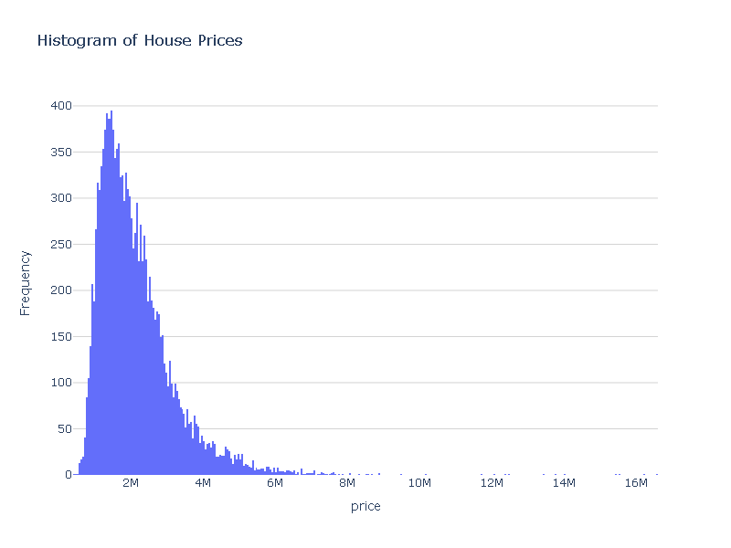
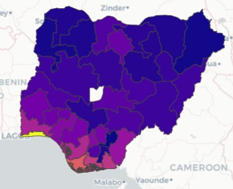
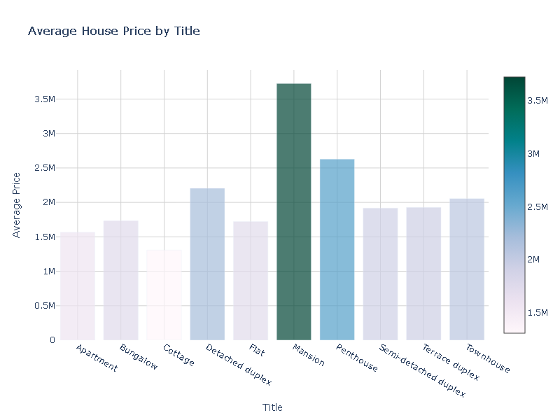
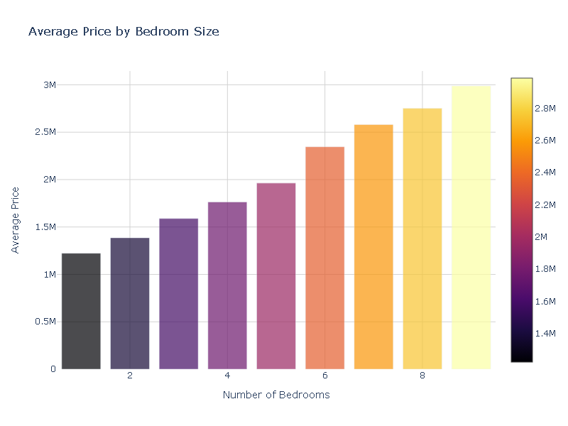

# DSN-AI-Bootcamp-2023-Qualification-Hackathon

This repository contains my solution for the DSN AI Bootcamp 2023 Qualification Project Participation/Hackathon. The hackathon challenges participants to create a robust predictive model for the house prices dataset. The solution demonstrates how AI can help with pricing decisions, market competitiveness, and customer value.
## DSN Logo

## Challenge Description

The DSN AI Bootcamp 2023 Qualification Hackathon is an exciting competition aimed at leveraging machine learning to build predictive models for house prices. Participants are provided with a dataset containing various features related to house listings, such as location, type of building, number of bedrooms, and other relevant attributes. The challenge is to develop a predictive model that accurately estimates the prices of houses based on these features.

## Data Source

The dataset for this hackathon was obtained from Zindi. You can find more information about the competition and access the dataset [here](https://zindi.africa/competitions/free-ai-classes-in-every-city-hackathon-2023).

For more details about the specific requirements and evaluation criteria, please refer to the [challenge page](https://github.com/DataScienceNigeria/DSN-AI-Bootcamp-2023-Qualification-Project-Participation-and-Hackathon/blob/main/ML%20with%20Azure-Python.md#judging-criteria).

## Solution Overview
The following steps were involved in building the predictive model:

1. **Data Preprocessing**: The dataset from Zindi was carefully cleaned and preprocessed to handle missing values and ensure consistency in the data.

2. **Exploratory Data Analysis**: Before building the model, I performed exploratory data analysis to gain insights into the distribution of house prices. To provide a better understanding, I included visualizations, such as histograms of the price distribution overall, as well as separate histograms for each location, building type, and the number of bedrooms.

### Histogram of Price Distribution

### Histogram of Price Distribution for Each Location

### Histogram of Price Distribution for Each Type of Building

### Histogram of Price Distribution for Number of Bedrooms

3. **Feature Engineering**: I engineered relevant features and encoded categorical variables to improve the model's performance.

4. **Model Selection and Training**: After splitting the dataset into training and testing sets, I selected the CatBoost model due to its ability to handle categorical data and its excellent performance in regression tasks. The model was trained on the training data.

5. **Model Evaluation**: The trained model's performance was evaluated on the testing data using appropriate metrics, such as Mean Squared Error (MSE) or Root Mean Squared Error (RMSE), to assess its accuracy in predicting house prices.

By combining advanced machine learning techniques and thorough data analysis, the predictive model developed for this hackathon aims to contribute to the understanding of house pricing trends, enabling smarter and data-driven decision-making in the real estate domain.
